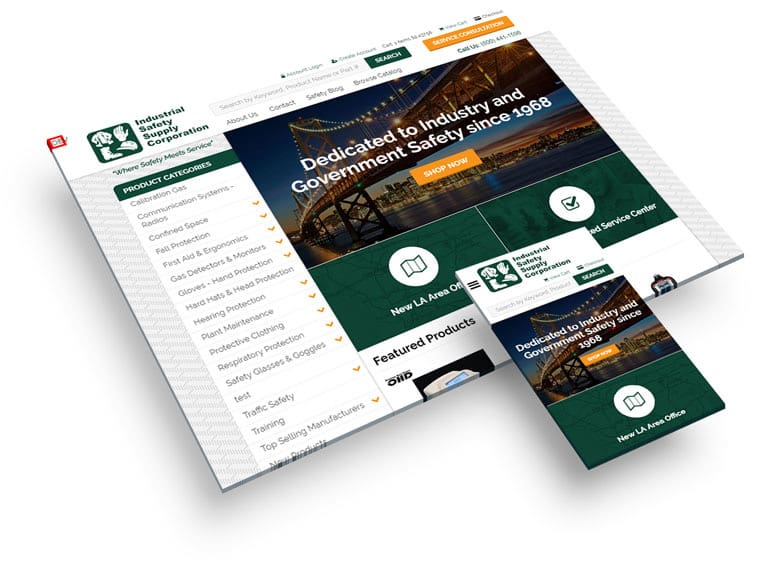

Behind every **good eCommerce website** is a **good strategy**. Who is this site being made for? How does that person prefer to shop online? Do they prefer to have a phone number to call or a form to fill out? What devices will he/she be using to browse the site? These are some of the critical questions that need to be answered before the site gets even close to being mocked up in Photoshop. Answering these questions will give us a clear picture of who to design for and what devices it should be optimized for.

**PROTIP:** If you find it hard to answer these questions... don't fret! Some of these questions can be answered from data we can gather from your existing website thanks to tools such as [Google Analytics](https://analytics.google.com/) or [Hotjar](https://www.hotjar.com/).

## The Design Proof

Once we've got the basic data points, we start out with a blank canvas in Photoshop and some basic company assets such as the **company logo** and **brand colors**. The majority of the *visual* design will be based on these two pillars in addition to the data points in our strategy session previously mentioned.

### Responsive Design

Responsive design is a term used a lot in our industry as of late, but what it actually refers to is **_fluidness_**.  The design needs to be fluid so that it can conform to the size of the device it's going to be viewed on. Like one of my favorite Bruce Lee quotes...

> When you pour water in a cup, it becomes the cup. When you pour water in a bottle, it becomes the bottle. When you pour water in a teapot, it becomes the teapot. Water can drip and it can crash. Become like water my friend.  ~ *Bruce Lee*

_**Your website needs to be like water!**_

**To get more technical:** we design responsive sites using a [12 column grid system](http://www.w3schools.com/bootstrap/bootstrap_grid_system.asp) which makes coding the design a much easier task. This is one of the primary reasons why it's so hard to take an existing design and "make it responsive". It really needs to be thought through in the design phase and not be a tacked-on (buggy) feature after the fact.

_An example of responsive design (desktop and phone)._

## The Critical Pages

The critical pages on an eCommerce website include not only the home page, but the product page and the entire checkout process.  These pages need a special attention to detail in order to create the absolute best user-experience for your new *and* returning customers.

One common bad practice on eCommerce websites is requiring a customer to create an account before checking out. This is an unneeded obstacle for people that don't want another username and password to have to remember. Having a "checkout as guest" feature can sometimes be the difference between making or losing that sale.

A design proof for all of these pages may not always be necessary but, be sure to talk to the developer that is creating these pages so they know what features you want because they don't always come "standard" depending on what platform you use.

## Wrap Up

Well, there you have it! Some insights to how we design eCommerce websites here at SMS. If you have any other insights or ideas you'd like feedback on or you just want to drop us a line, please share in the comments below!
