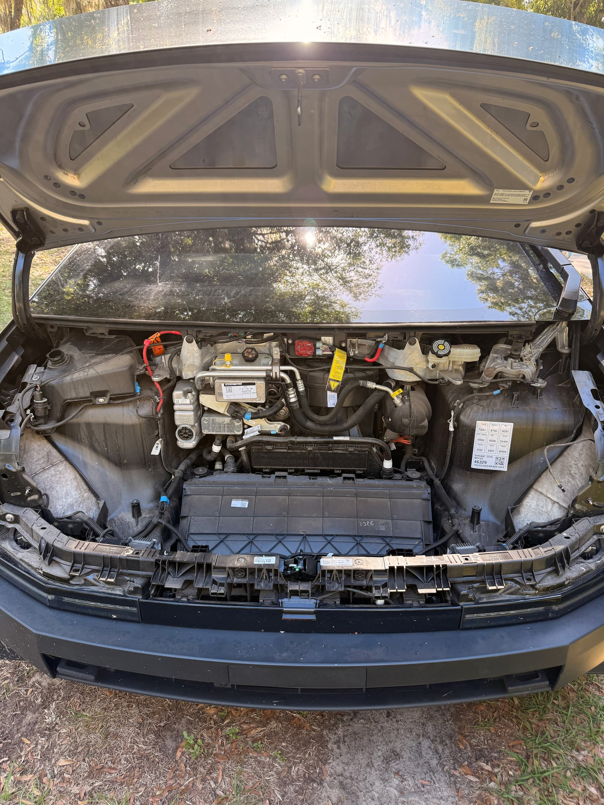
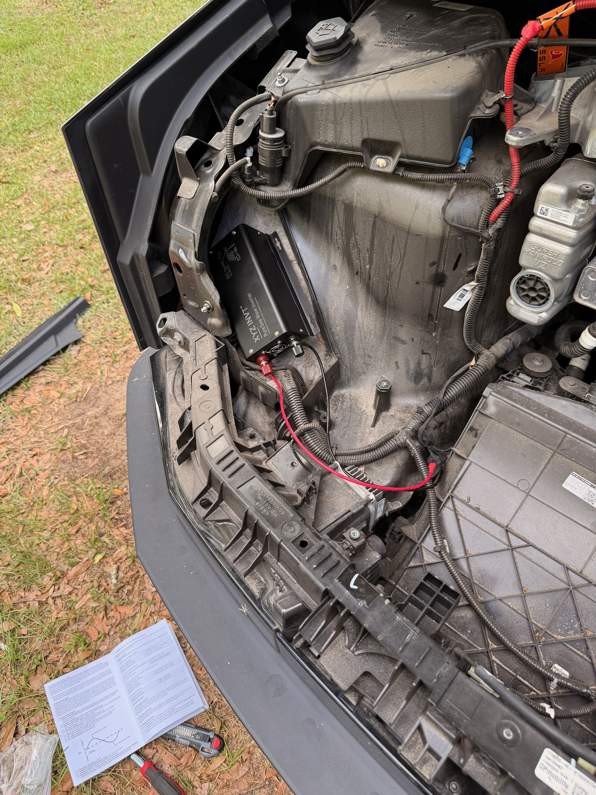
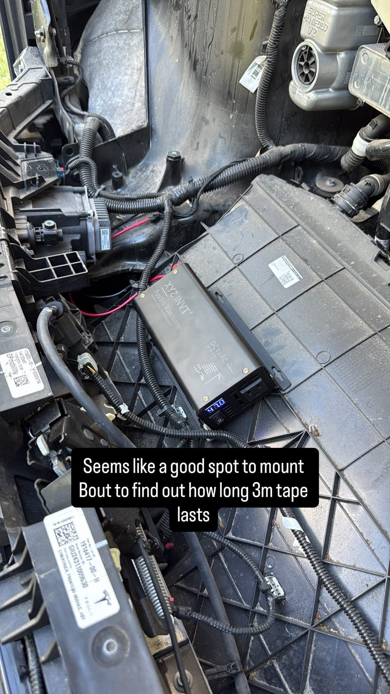
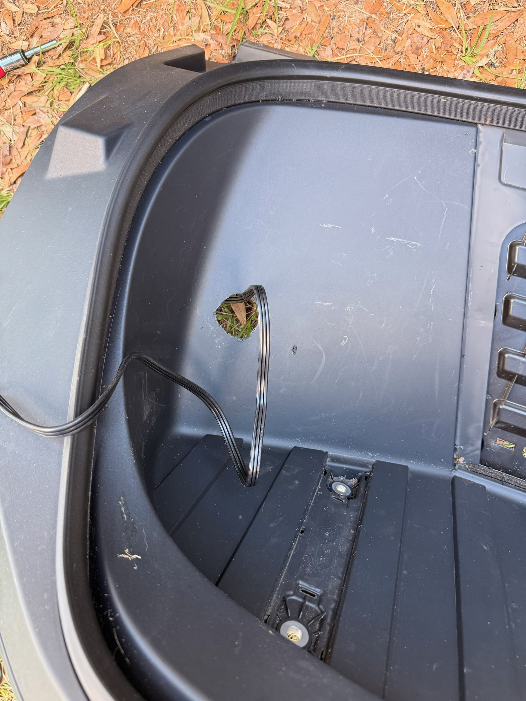
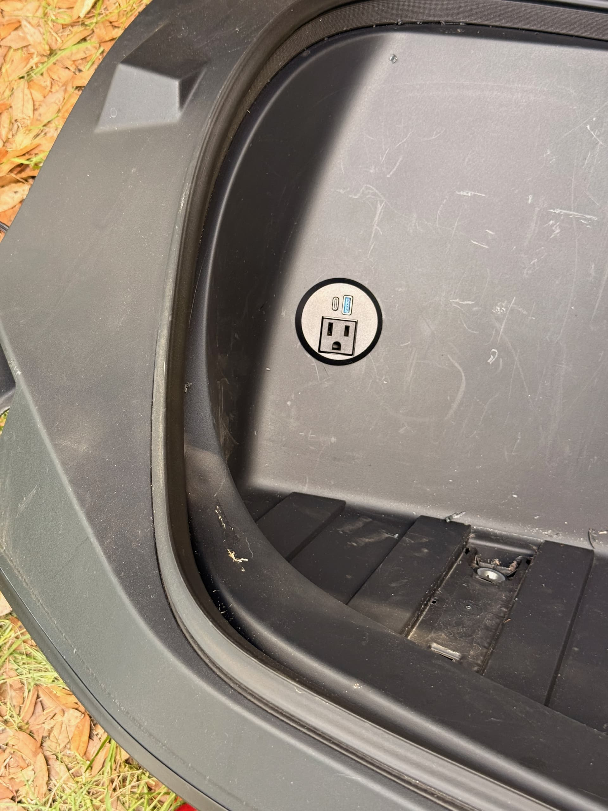
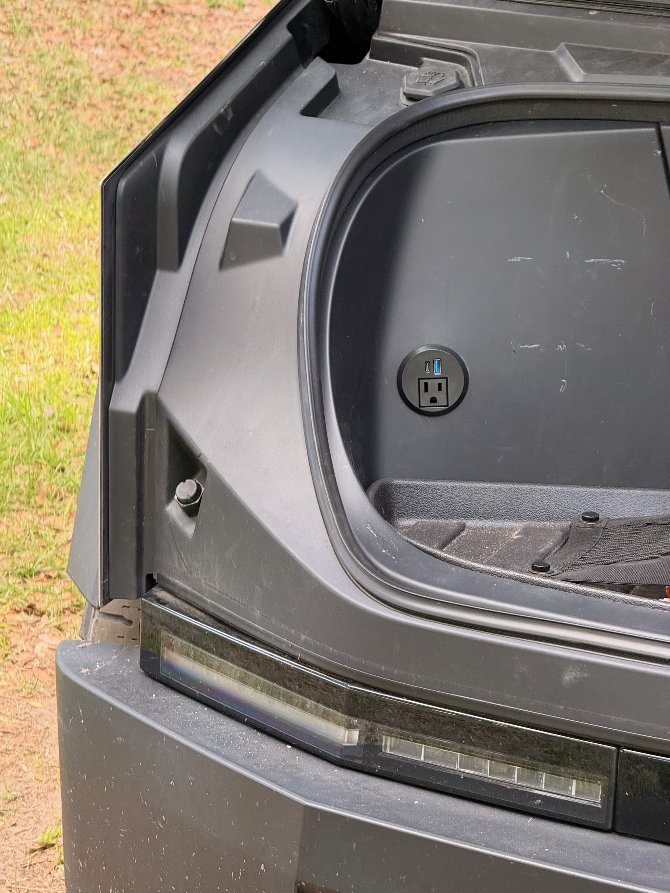

The Cybertruck already has 120V outlets in the bed, but I wanted one in the frunk too. It is one of those small quality-of-life upgrades that feels like it should have been there from the factory. The frunk is where I keep a lot of the stuff I want easy access to, so having power there makes more sense for small chargers, tool batteries, lights, or anything else I do not want sliding around in the bed.

There are basically two ways to add one.

The first option is to run an extension cord from the existing truck bed outlets, hide it under the trim and through the wheel well area, and bring it forward into the frunk. That works, and you get the same outlet capacity as the bed, but you are really just relocating one of the existing outlets.

The second option is to use the 48V power feed already available in the frunk and add a dedicated inverter. This is the route I liked better because it actually adds another outlet instead of just moving one. The trade-off is that the 48V feed is limited to 400 watts, but I am fine with that. If I need more than 400 watts, I can just use the outlets that are already in the bed.

If you go with the second option like I did, you will need a [sine wave inverter](https://www.amazon.com/WZRELB-Power-Inverter-Adapter-Display/dp/B0D8Y5B6N7?th=1&linkCode=ll2&tag=stefphel-20&linkId=861da4dfc5b80c3269b64018194ceeaa&language=en_US&ref_=as_li_ss_tl) and a [recessed outlet](https://www.amazon.com/dp/B0F8QDSRBZ?th=1&linkCode=ll2&tag=stefphel-20&linkId=f7189389c7ef984ceb1524b7663df20d&language=en_US&ref_=as_li_ss_tl).

## Step 1. Frunk Trim Removal

There are a total of 8 bolts holding in the trim piece of the frunk and a single cable to the frunk button. It takes about 5 minutes to remove this piece. If you can't find one of the bolts, use the [Tesla Service Manual](https://service.tesla.com/docs/Cybertruck/ServiceManual/en-us/GUID-46266AE5-348E-4581-9634-3F1CFC5123AF.html).

## Step 2. Mount and Wire the Sine Wave Inverter

For this install, the 48V feed powers a small pure sine wave inverter mounted behind the frunk trim. From there, the inverter feeds a 120V outlet installed into the trim panel.

The goal was to keep everything clean and factory-looking from the outside. I did not want a loose inverter sitting in the frunk, and I did not want cords hanging out every time I opened it. Once the trim is back in place, the only visible part of the install is the outlet itself.

I used some 3M double-sided adhesive to mount the inverter to the top of the radiator cover because I didn't want to drill into that plastic. I'm not too worried about it getting dislodged because even if I hit a large pothole, there really isn't much space for it to move. At least in theory.

## Step 3. Cutting the Trim

This was the point of no return. I measured the outlet location, cut the opening in the trim, and test fit the outlet before reinstalling anything.

After the outlet fit cleanly, I connected everything and checked that the trim could sit back in place without putting stress on the wiring.

## Final Result

Once the trim was reinstalled, the outlet looked right at home. This is exactly what I wanted: a clean frunk outlet for smaller 120V needs without running a cord from the bed every time.

If you want to add a separate outlet and you are fine with the 400 watt limit, the 48V feed and inverter approach is the way to go.
