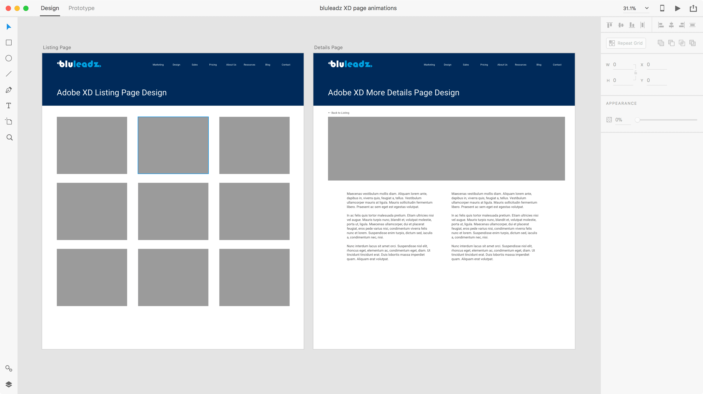

Designers creating new website mockups will generally use Photoshop then save those mockups as a JPG or PNG for the client to review. The problem with static images is they don't tell the whole story of what the website could be. Hover state, the way the page loads, or even the way the page transitions to a new view—these are all elements that are usually not given any thought and are left up to the developer to make assumptions, or worse, not implement anything at all. What you're left with is a website that feels janky.

## Introducing Adobe XD

For simple page animations and adding context to how each page fits together, Adobe XD is the perfect tool—not to mention, it's also an extremely quick way to design page layouts.

### Adding page transitions in Adobe XD

First off, you'll need at least 2 artboards. Each artboard represents a page (or a new view in your app).

Once you have multiple artboards setup, click on the prototype tab. Then, you're going to want to select the element in your design that should be linked to the other artboard, such as a standard link for example. Once selected, click and drag the blue tab to the corresponding artboard, and then choose your animation type and speed.

Once linked, you can click the play button in the top right corner to view the animation, share the preview online, or even create a video walk-through of the pages.

## Quickly Prototype Modules in CodePen

For more complex animations and/or animating specific elements on the page, CodePen is an extremely quick way to prototype. It has built-in CSS and HTML preprocessing and everything created on the site is easily shared.

### Create a Pen

Head on over to [codepen.io](https://codepen.io) and get comfy. You may want to start off by searching for a specific animation that you're looking for. However, if you know HTML and CSS you can create a new pen from scratch. Once you've got your pen created, save it and keep the URL handy for when you're reviewing that design with the client or developer.

Here's a recent example of a simple hover animation we created for a custom home page module:

See the Pen [Animated "tabs" on Hover](https://codepen.io/stefen/pen/dZXqoG/) by Stefen ([@stefen](https://codepen.io/stefen)) on [CodePen](https://codepen.io).

See the Pen <a href="https://codepen.io/stefen/pen/dZXqoG/">Animated &amp;quot;tabs&amp;quot; on Hover</a> by Stefen (<a href="https://codepen.io/stefen">@stefen</a>) on <a href="https://codepen.io">CodePen</a>.

Not only does it make it easier to convey the vision for the design, but the same code can also be used in development for maximum efficiency.

## For non-developers: Keynote is awesome!

I know coding isn't for everyone... shocker! Well don't worry, because you can create some pretty amazing animations in Apple's Keynote software. [InVision has a really great blog post on how to do this](https://www.invisionapp.com/blog/animating-your-ui-designs-in-keynote/). The basic idea is that you create a beginning and end state for your animation, add those elements to a slide and use Keynote's built-in animation tools to go from the beginning and end state and export as a video.

## Motion Design Is More Important Than Ever

Animations on the web are easily overlooked elements of the standard website design process and hard to explain without building some type of prototype. Using any one of the above 3 techniques will improve your end product. Even if you don't build a prototype yourself, there are plenty of amazing examples on CodePen that you might want to incorporate into your design.

---

[Originally published on Bluleadz](https://www.bluleadz.com/blog/how-to-add-animations-to-your-static-designs-using-adobe-xd-and-codepen)
