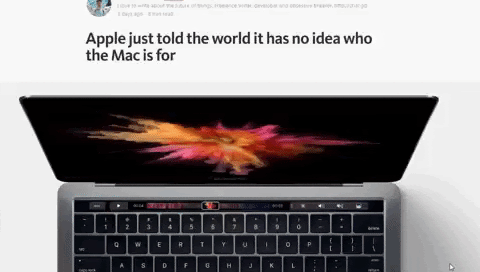

I am a big fan of the way Instagram's mobile app and [Medium](https://jmperezperez.com/medium-image-progressive-loading-placeholder/)'s website load images. If you don't know what I'm talking about, it's when an extremely small image is scaled up, blurred out and is loaded before the full image... eventually fading into the full image once it has loaded. Like so:



Providing visual feedback to end users — **especially users with slower connections** — that something is happening is a great way to improve UX. Thanks to HubSpot's [automatic image resizing](https://knowledge.hubspot.com/articles/kcs_article/cos-general/what-is-automatic-image-resizing) and a nifty little script by David Desandro (the man behind [metafizzy](http://metafizzy.co/)) it's pretty easy to achieve the same effect on your HubSpot website:


---

## How To Create Progressive Loading Images in HubSpot

### Step 1: The HubL

If you haven't noticed, full-width image backgrounds are all the rage in web design these days. Because they are so large, they are the perfect candidate for this image loading technique. In HubSpot you'll need to either use a custom module or a HubL module so you can manipulate the image's _src_ attribute. We are using a custom module for our headers like so:

```twig
<div class="bg-section-header" style="background-image:url({{ widget.background_image.src }});">
    <div class="bg-section-header_placeholder" style="background-image: url({{ widget.background_image.src }}?width=20);"></div>
    <h1>{{ widget.header }}</h1>
    <p class="secondary-header">{{ widget.secondary_header }}</p>
</div>
```

As usual, we use an inline style for the image so it can be unique on each page. The real magic happens in the child div "bg-section-header_placholder". We use the same code to display the same image, but appending the src with "?width=20". Doing this tells HubSpot's servers to resize the image to 20px using their image resizing magic.

One thing to note, HubSpot uses two different URLs for loading images. One for images that are compressed/resized and one for images that are not compressed/resized:

- Doesn't resize: **example.com/**hubfs**/image.png**
- Does resize: _example.com/**hs-fs/hubfs**/image.png_

By default, the custom module will use the URL that doesn't resize the image. To get around this you can use the "replace" HubL filter to replace the default URL like so:

```twig
<div class="bg-section-header" style="background-image:url({{ widget.background_image.src }});">
    <div class="bg-section-header_placeholder" style="background-image: url({{ widget.background_image.src|replace('/hubfs/','/hs-fs/hubfs/') }}?width=20);"></div>
    <h1>{{ widget.header }}</h1>
    <p class="secondary-header">{{ widget.secondary_header }}</p>
</div>
```

**NOTE**: if you prefer to use the default "cdn2.hubspot.com" URLs you'll need to use a different replace filter:

```twig
{{ widget.background_image.src|replace('/hubfs/' + hub_id, '/hub/' + hub_id + '/hubfs') }}
```

_Thanks Kenneth!_

### Step 2: The CSS

Now just add a little CSS and you'll have your background image and the small/blurry placeholder image:

```css
.bg-section-header {
  background-color: #222;
  background-position: center;
  background-size: cover;
  color: #fff;
  position: relative;
}
.bg-section-header_placeholder {
  background-color: #222;
  background-position: center;
  background-size: cover;
  opacity: 1;
  transition: opacity 400ms ease;
  position: absolute;
  top: 0;
  left: 0;
  right: 0;
  bottom: 0;
  width: 100%;
  height: 100%;
}
```

### Step 3: The JavaScript

Now the final step is to fade out the placeholder image once the full size image loads. With the [imagesLoaded](http://imagesloaded.desandro.com/) script, we can detect when the background image loads and create a function to change the opacity of the placeholder to 0 with this callback:

```javascript
$(".bg-section-header").imagesLoaded({ background: true }, function () {
  $(".bg-section-header_placeholder").css("opacity", "0");
});
```

**Pretty cool, right?**

The only downside to doing this is that you are adding an extra HTTP request to the page. However, I would argue this being a non-issue with [HTTP/2](https://http2.github.io/) just around the corner and, in the meantime, I believe the improved UX is a tradeoff well worth the extra 50 milliseconds.
